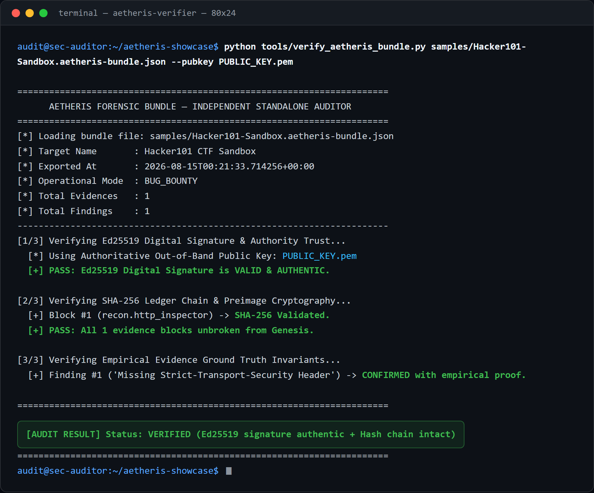
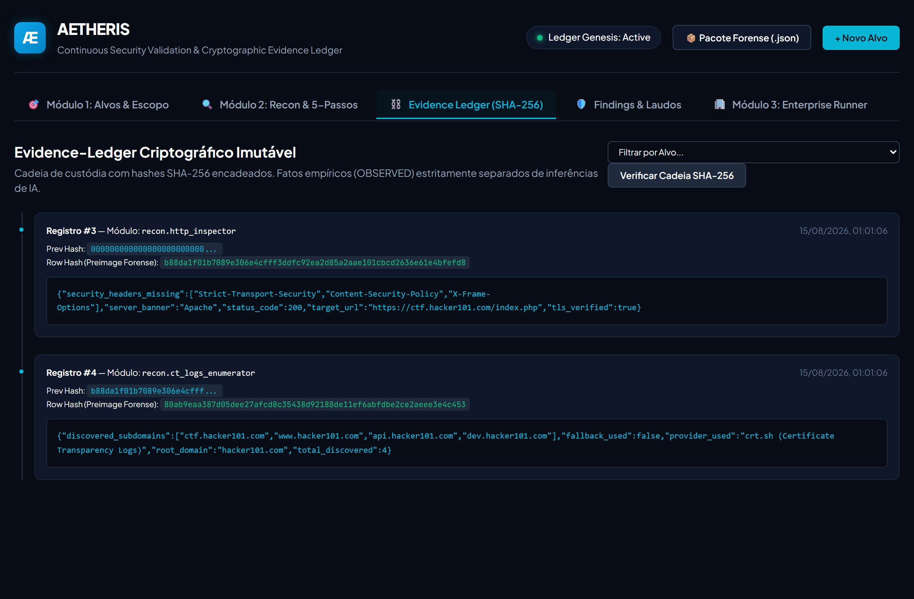
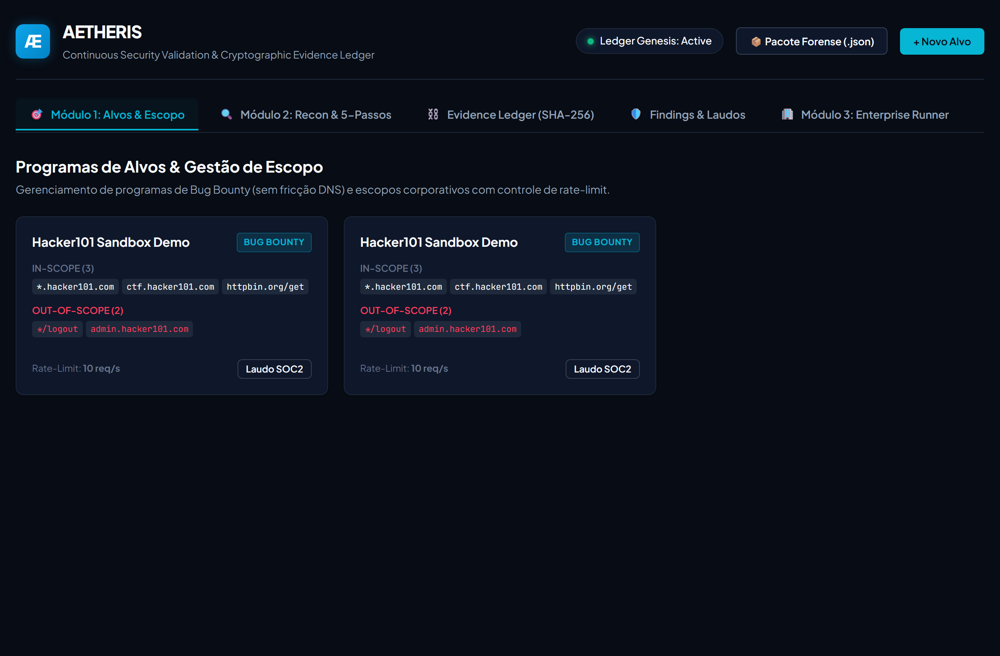
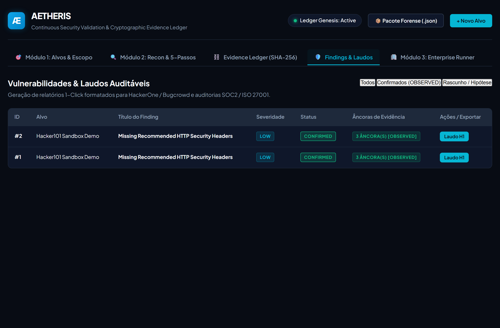

# AETHERIS

**A verifiable security evidence engine.**

AETHERIS turns security findings into a tamper-evident, cryptographically signed evidence chain that a third party can verify *without trusting the tool that produced it*. It is built around one principle most security tooling ignores: **an empirically observed fact and an inferred judgment are not the same thing, and a system of record must never let one masquerade as the other.**

---

## What this is — and what it is not

**It is** an evidence ledger. Every network observation is recorded as an append-only, hash-chained entry. Findings cannot claim "confirmed" status without a linked empirical anchor. The whole record can be exported as a self-contained bundle and audited by an independent verifier.

**It is not** a deep vulnerability scanner. The reconnaissance layer (security headers, CORS reflection, exposed files, passive subdomain discovery) exists to *produce reference evidence for the ledger* — not to compete with mature DAST/ASM tooling. The scanner is deliberately shallow. The value is the evidence layer underneath it.

If you are evaluating this, evaluate the ledger and the verifier. That is where the engineering is.

---

## The core idea: OBSERVED vs. INFERRED

Security tooling routinely blurs two categories:

- **`OBSERVED`** — a raw fact verified over the network. *"The server reflected `Origin: evil.example.com` in `Access-Control-Allow-Origin`."*
- **`INFERRED`** — a hypothesis or risk judgment produced by a model or a linter. *"This CORS configuration is exploitable and rated HIGH."*

AETHERIS keeps them structurally separate and enforces an invariant at the data layer:

> A finding cannot be promoted to `CONFIRMED` unless it is anchored to at least one `OBSERVED` observation.

Findings are born `DRAFT`. Promotion to `CONFIRMED` is an attested transition that requires an empirical anchor — it is not a field an arbitrary code path can set. A risk *severity* is treated as an `INFERRED` judgment; the empirical anchor proves that the *behavior exists*, never that the risk rating is correct. This is the guardrail that stops an AI-assisted pipeline from laundering a hallucinated severity into the permanent record.

---

## Verify it yourself (don't trust this README)

The point of the project is independent verifiability, so the repository ships a **standalone verifier** and a **real signed evidence bundle**.

```bash
# Only dependency: the `cryptography` library. No AETHERIS server required.
python tools/verify_aetheris_bundle.py samples/Hacker101-Sandbox.aetheris-bundle.json --pubkey PUBLIC_KEY.pem
```

The verifier, in isolation:

1. Validates the **Ed25519 signature** over the canonical bundle body.
2. Recomputes the entire **SHA-256 hash chain** from genesis, binding `target_id`, `source_module`, `captured_at`, `payload_sha` and `prev_sha` into each block's preimage.
3. Re-checks the **`OBSERVED`-anchor invariant** on every `CONFIRMED` finding.

Design choices that matter for a hostile reviewer:

- **Zero internal imports.** The verifier depends only on the Python standard library and `cryptography`. It does not import a single line of application code — it is a genuinely independent auditor, not the same system wearing a different hat.
- **Fail-closed.** If `cryptography` is not installed, the verifier aborts with a fatal error. It never skips the signature check and reports success. (This was a real fail-open bug caught during hardening — see engineering notes.)
- **Out-of-band trust anchor.** The `--pubkey` flag lets an auditor supply the authoritative public key published *outside* the bundle (site, DNS TXT, bug-bounty profile). The signature proves integrity; the external key proves authorship. The verifier does not blindly trust the key embedded in the file.

---

## What it looks like

The standalone verifier auditing a signed bundle — the core promise, run end to end:



The evidence ledger: each observation SHA-256 chained to the previous block.



Scope configuration and target governance:



Findings anchored to empirical evidence proofs:



---

## Architecture

```
                 ┌──────────────────────────────────────────┐
                 │            EVIDENCE PRODUCERS             │
                 │  non-destructive recon · passive CT-logs  │
                 │  (reference producers, not the product)   │
                 └───────────────────┬──────────────────────┘
                                     │ raw observations
                                     ▼
                 ┌──────────────────────────────────────────┐
                 │        DETERMINISTIC EVIDENCE LEDGER      │
                 │  append-only · SHA-256 chained · canonical│
                 │  payload persisted · OBSERVED/INFERRED    │
                 │  separation · confirmation invariant      │
                 └───────────────────┬──────────────────────┘
                                     │ export
                                     ▼
                 ┌──────────────────────────────────────────┐
                 │      SIGNED, SELF-CONTAINED BUNDLE        │
                 │  Ed25519 seal · full chain · anchors      │
                 │  → audited by the STANDALONE VERIFIER     │
                 └──────────────────────────────────────────┘
```

**The ledger.** Each entry stores the exact canonical bytes it was hashed over (`canonical_payload`), so verification is bound to those bytes and is immune to database-layer JSON normalization (e.g. PostgreSQL `JSONB` reordering keys or coercing `1.0`→`1`). Every block's `row_sha` commits to its forensic metadata, not just the payload — evidence cannot be silently moved between targets or re-timestamped without breaking the chain.

**Scope engine.** Authorization is a first-class, auditable decision. Supports wildcard domains, CIDR ranges (for internal/enterprise mode), and IDNA normalization; rejects dangerously broad patterns (e.g. a bare `*`). Every in/out-of-scope decision is recorded with the matched rule and reason.

**Signing.** Ed25519 over the canonical bundle body. The private key lives outside the repository (`AETHERIS_KEYS_DIR`), is git-ignored, and is never embedded in code.

---

## Threat model

**What AETHERIS defends against**

- *Silent tampering with the record.* Any edit to a stored observation breaks the hash chain; the verifier detects it.
- *Category confusion.* An inferred judgment cannot be recorded as an empirical fact, and a finding cannot be confirmed without an empirical anchor.
- *Forged provenance.* The Ed25519 signature plus an out-of-band public key establish authorship, not just integrity.
- *Application attack surface.* The API is authenticated (timing-safe `X-API-Key`), guarded against SSRF (including redirect-hop bypass and cloud-metadata / RFC 1918 / loopback targets), and refuses to boot with a missing or weak key.

**Trust assumptions AETHERIS does *not* yet remove** *(stated plainly — see Limitations)*

- The `captured_at` timestamp is asserted by the operator's clock. It is bound into the hash (so it cannot be altered after the fact without breaking the chain), but it is **not** anchored to an external time authority. AETHERIS proves internal ordering, not the absolute wall-clock time an event occurred.
- The operator is currently the sole custodian of the ledger. There is no external, write-once replica that the operator themselves cannot rewrite.

A hash chain is **tamper-evident**, not tamper-proof: an actor who can rewrite the entire store can recompute a clean chain. Signing and an out-of-band key close the *authorship* gap; external time-stamping and WORM replication (below) are what close the remaining custody gap for a legal-forensic setting.

---

## Security posture

Hardening was driven by an adversarial review and every fix is backed by a **rejection test** — a test that exercises the *blocked* path, not just the happy path.

| Control | Mechanism | Proven by |
|---|---|---|
| Authentication | Timing-safe `X-API-Key` (`hmac.compare_digest`) as a router-level dependency on all `/api/v1` routes; `/health` intentionally open | request without key → `401`; forged key → `403`; valid key → `200` |
| Anti-SSRF | DNS resolution + IP blocklist (cloud-metadata, RFC 1918, loopback, link-local, IPv6 ULA) before connect; redirect hops re-validated | direct + `302`-redirect to `169.254.169.254` both blocked |
| Secret hygiene | Signing key generated outside the repo, git-ignored, rotated; no key material in source | key generation path is external and parameterized |
| Fail-closed config | No default API key; boot aborts on a missing, short, or placeholder key | boot rejected without a strong key |
| Transport egress | Strict CORS allowlist (no wildcard-with-credentials); structured audit logging | explicit origin allowlist in config |
| Rate limiting | Per-target throttle on recon and passive-discovery probes | — |

---

## Limitations & roadmap

Stated honestly, because a security product that hides its limitations is not one.

- **RFC 3161 trusted timestamping** — anchor the head hash to an external Time Stamp Authority (or an OpenTimestamps / Certificate-Transparency-style log) so the evidence's existence-in-time is provable to a hostile third party, not just internally ordered. *Highest-value next step for forensic grade.*
- **WORM / external replication** — mirror each signed checkpoint to write-once storage (e.g. S3 Object Lock) so the operator is not the sole custodian.
- **Merkle checkpointing** — replace linear re-verification with compact `O(log n)` inclusion proofs for a single piece of evidence, enabling efficient third-party audit and cheaper external anchoring.
- **Recon depth is intentionally out of scope.** The evidence layer is the product; deep vulnerability detection is a commodity better served by dedicated tooling.

---

## Tech stack

Python 3.10+ · FastAPI · SQLAlchemy (async) · Pydantic v2 · SQLite (zero-config local) / PostgreSQL (production) · `cryptography` (Ed25519) · `dnspython` · vanilla JS SPA frontend.

Test suite: 23 passing tests, including dedicated **rejection tests** for authentication, SSRF (direct and redirect-based), DNS-ownership verification, fail-closed configuration, and JSONB-mutation immunity of the ledger.

---

## Engineering notes

Short write-ups on the non-obvious decisions:

- **[The OBSERVED/INFERRED invariant](./writeups/observed-vs-inferred-invariant.md)** — why separating empirical fact from inferred risk is the guardrail that keeps an AI-assisted security pipeline honest.
- **[A fail-open in a forensic verifier](./writeups/fail-open-forensic-verifier.md)** — how a `try/except ImportError` around the signature check silently turned "verified" into "unverified but reported as passing," and why forensic tooling must fail closed.

---

## Status & access

- **Status:** working system; core hardened and independently verifiable.
- **Source availability:** proprietary. This repository is a showcase — the architecture, threat model, and a verifiable sample bundle are public; the backend implementation is available for review on request.
- **Authoritative public key:** the canonical Ed25519 public key is published in this repository as [`PUBLIC_KEY.pem`](./PUBLIC_KEY.pem). Pass it to the verifier with `--pubkey PUBLIC_KEY.pem` to check any bundle's signature against the out-of-band key.
- **Contact:** aragaobruno@gmail.com

---

*AETHERIS is a personal engineering project. It is designed to be run only against assets you own or are explicitly authorized to test (e.g. a bug-bounty program with a published safe-harbor scope).*
